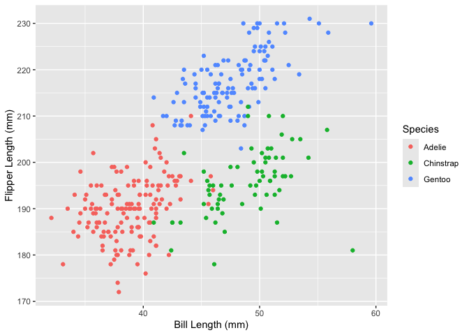

p8105_hw1_qh2285
================
Qianxuan Huang
2024-09-13

## R Markdown

This is an R Markdown document. Markdown is a simple formatting syntax
for authoring HTML, PDF, and MS Word documents. For more details on
using R Markdown see <http://rmarkdown.rstudio.com>.

When you click the **Knit** button a document will be generated that
includes both content as well as the output of any embedded R code
chunks within the document. You can embed an R code chunk like this.

# Problem 1

``` r
library("palmerpenguins")
```

``` r
data("penguins", package = "palmerpenguins")
head(penguins)
```

    ## # A tibble: 6 × 8
    ##   species island    bill_length_mm bill_depth_mm flipper_length_mm body_mass_g
    ##   <fct>   <fct>              <dbl>         <dbl>             <int>       <int>
    ## 1 Adelie  Torgersen           39.1          18.7               181        3750
    ## 2 Adelie  Torgersen           39.5          17.4               186        3800
    ## 3 Adelie  Torgersen           40.3          18                 195        3250
    ## 4 Adelie  Torgersen           NA            NA                  NA          NA
    ## 5 Adelie  Torgersen           36.7          19.3               193        3450
    ## 6 Adelie  Torgersen           39.3          20.6               190        3650
    ## # ℹ 2 more variables: sex <fct>, year <int>

``` r
mean(penguins$flipper_length_mm, na.rm = TRUE)
```

    ## [1] 200.9152

The penguins dataset includes 6 rows 8 columns. All 6 penguins are
species Adelie from island Torgersen in year 2007. They have different
bill_length_mm, bill_depth_mm, flipper_length_mm, body_mass_g, sex. The
mean flipper length is 200.9152mm.

``` r
library(ggplot2)
library(palmerpenguins)

p = ggplot(penguins, aes(x = bill_length_mm, y = flipper_length_mm, color = species)) +
  geom_point() +
  labs(x = "Bill Length (mm)", y = "Flipper Length (mm)", color = "Species") 
print(p)
```

    ## Warning: Removed 2 rows containing missing values or values outside the scale range
    ## (`geom_point()`).

<!-- -->

``` r
ggsave("problem1_scatterplot.png", plot = p)
```

    ## Saving 7 x 5 in image

    ## Warning: Removed 2 rows containing missing values or values outside the scale range
    ## (`geom_point()`).

# Problem 2

- Create data frame：

``` r
random_sample = rnorm(10)
logical_vector = random_sample > 0
character_vector = sample(letters, 10)
factor_levels = c("L1", "L2", "L3")
factor_vector = factor(sample(factor_levels, 10, replace = TRUE))

data_frame = data.frame(random_sample, logical_vector, character_vector, factor_vector)
print(data_frame)
```

    ##    random_sample logical_vector character_vector factor_vector
    ## 1     0.13015105           TRUE                k            L1
    ## 2     0.34575346           TRUE                e            L2
    ## 3     0.27514075           TRUE                l            L1
    ## 4    -0.52644715          FALSE                g            L2
    ## 5     1.00999317           TRUE                c            L1
    ## 6     0.02561993           TRUE                y            L1
    ## 7    -1.78977684          FALSE                b            L2
    ## 8     0.16029657           TRUE                p            L2
    ## 9    -0.32970098          FALSE                h            L2
    ## 10    0.53273978           TRUE                o            L3

- Take the mean of each variable in above dataframe:

1.  Mean of random_sample:

``` r
library(tidyverse)
```

    ## ── Attaching core tidyverse packages ──────────────────────── tidyverse 2.0.0 ──
    ## ✔ dplyr     1.1.4     ✔ readr     2.1.5
    ## ✔ forcats   1.0.0     ✔ stringr   1.5.1
    ## ✔ lubridate 1.9.3     ✔ tibble    3.2.1
    ## ✔ purrr     1.0.2     ✔ tidyr     1.3.1
    ## ── Conflicts ────────────────────────────────────────── tidyverse_conflicts() ──
    ## ✖ dplyr::filter() masks stats::filter()
    ## ✖ dplyr::lag()    masks stats::lag()
    ## ℹ Use the conflicted package (<http://conflicted.r-lib.org/>) to force all conflicts to become errors

``` r
mean_random_sample =  mean(pull(data_frame, random_sample))
print(mean_random_sample)
```

    ## [1] -0.01662303

Mean of random_sample works.

2.  Mean of logical_vector:

``` r
mean_logical_vector =  mean(pull(data_frame, logical_vector))
print(mean_logical_vector)
```

    ## [1] 0.7

Mean of logical_vector works.

3.  Mean of character_vector:

``` r
mean_character_vector =  mean(pull(data_frame, character_vector))
```

    ## Warning in mean.default(pull(data_frame, character_vector)): argument is not
    ## numeric or logical: returning NA

``` r
print(mean_character_vector)
```

    ## [1] NA

Mean of character_vector doesn’t work.

4.  Mean of factor_vector

``` r
mean_factor_vector =  mean(pull(data_frame, factor_vector))
```

    ## Warning in mean.default(pull(data_frame, factor_vector)): argument is not
    ## numeric or logical: returning NA

``` r
print(mean_factor_vector)
```

    ## [1] NA

Mean of factor_vector doesn’t work.

- Convert variables to numerical variables:

``` r
numeric_logical = as.numeric(data_frame$logical_vector)

numeric_character = as.numeric(data_frame$character_vector)
```

    ## Warning: NAs introduced by coercion

``` r
numeric_factor = as.numeric(data_frame$factor_vector)
```

Only numeric_character shows warning, because as.numeric() extracts the
inner numbers encoding of variables and no numbers are in
character_vector. R convert “False” and “True” in logical_vector into 0
and 1, so mean of logical_vector can be calculated and can be converted
to numerical variables. Partial factor_vector include number, e.g. “L1”
convert to 1. But mean of character_vector cannot be calculated when
character_vector is still not numerical variable.
